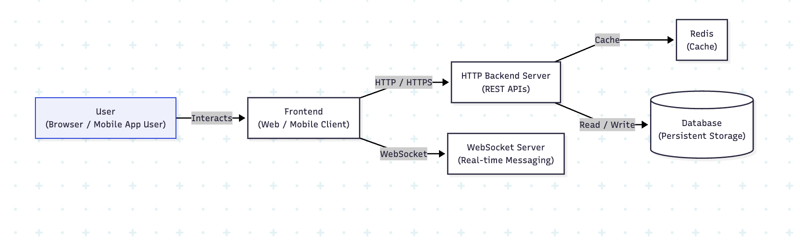

# Real-Time Multi-Room Chat App

## Website where you can connect and communicate with people and teams in without any delay and scales to thousands of concurrent users

# System Architecture

## Architecture Explanation
 In this project i have three microservice -> frontend, Http-Backend and WebSocket-Server 

1. frontend connects to `httpBackend` for fetching the old records of user activity  and for state recovery if the frontend goes down and also connects with ` WebSocket-Server` for real time communication

2. http-server first do the authentication with `Jwt method` and for rest of the request validates it so that no user who is not authentic and authorised can send request and then handles all the logic for featues supported 

3. Websocket Server is gets connected to frontend and handles all the real time communication and supports user Featues and also the connection is only made with validate user checked by token which the user put in websocket connection url

# Demo 
Demo-link https://www.youtube.com/watch?v=rq2T2pw_MHU

# Tech Stack

1. `frontend` - `nextjs`(react), `zustand`(state management),`shadcn and radix`(styled and unstyled component)

2. `Http-backend`- nodejs, express ,bycrpt
3. `WebSocket-Server` - native ws 
4. `Authentication` - JsonWebToken(jwt),cors
5. `caching` - Redis
6. `Database` - primsaORM , postgres
7. `Deployment` - Docker(containerized approach), AWS EC2,nginx
8. `Testing` - Vitest(integration Tests) and playwright(end to end Testing) 
9. `Github-Action `- CI,CD Pipeline

# Testing 
1. HttpBackend - Integration test(`Vitest`) 
2. Frontend - End To End Tests(`playwright`)
   
# Deployment and CI/CD
1. Created a docker file for each application for isolated running 
2. On Push:
   - The workflow checks out the code
   - Installs Dependencies and Run automated Tests to prevent broken deployment
3. if tests Passs:
   - Builds Docker images for each application
   - Tags images with latest
   - Pushes the images to docker  hub
4. After successful image push:
   - GitHub Actions SSHs into the EC2 instance
   - Stops the old running container (if any)
   - Pulls the latest image from Docker Hub
   - Restarts the container with the updated image

# Key Featues 
1. Real time communication using websocket
2. Separation between Rest and RealTime communication
3. stateful WebSocket Server(build's state from frontend sending data about user )
4. Create and Join Room and also leave and delete room 
   

# Data Flow 

### Authentication & Session Setup

 1. User accesses the application via the frontend.

2. Frontend sends authentication request to the HTTP backend.

3. HTTP backend validates credentials.

4. On success, backend generates a JWT and sets it as an HTTP-only cookie in the browser

### User Initialization

1. Frontend fetches user-related data from the HTTP backend.

2. User state is initialized and stored in frontend state management.

3. Frontend simultaneously establishes a WebSocket connection for real-time communication.

### Room Management

1. User creates or joins a chat room.

2. WebSocket server subscribes the user’s connection to the corresponding room.

3. User can now send and receive real-time messages within that room.

### Message Sending Flow

1. User sends a message from the frontend.

2. Frontend sends the message request to the HTTP backend.

HTTP backend:

3. Validates the user using JWT.

4. Publishes the message to Redis for fast, non-blocking processing.

5. Backend immediately responds to the frontend for low latency.

### Message Persistence & Caching

1. A background worker consumes messages from Redis.

Worker:

2. Persists messages into the database.

3. Updates cache for recently accessed or unchanged data to optimize reads

### Message Delivery

1. WebSocket server receives message events.

2. Being stateful, it:

3. Maintains active client connections.

4. Broadcasts messages to all users subscribed to the same room in real time.

# Local setup

1. Clone the repo by this command-> `git clone https://github.com/SumitKumar777/Chatapp.git`

2. Install dependency-> `pnpm install or npm install `
3. Copy the env.examples to .env file in every app and replace url with your own local url 

4. Run command from the root of the repo (`Docker must be installed `) ->` docker compose -f docker-compose.yaml up -d `
5. Run manually - > run `pnpm run dev `or `npm run dev`  or Go to each app and start it 

# Limitation (Flaws)
1. NO Horizontal Scalling in both httpBackend and WebSocketServer
2. Bad UI in the frontend (Will improve in future)
3. NO State management in real Time communication like no way to know if user is present and how many are their in room (wil do it  😅)

# Future Improvemnt
1. Add Video Calling and screen sharing
2. And Correct all the above mentioned limitation(Flaws)

# Thank you for Reading
